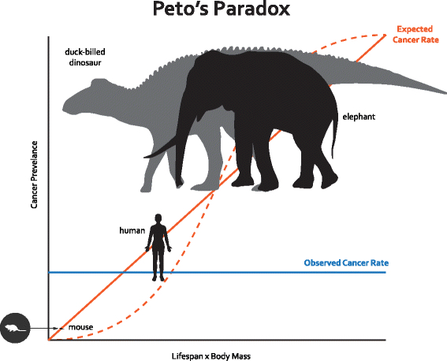

<!-- The file chunks.R contains chunks that define default settings -->
```{r read-chunk, include=FALSE, cache=FALSE}
knitr::read_chunk("chunks.R")
```

<!-- Update knitr chunk options -->
```{r knitr-opts-chunk, include=FALSE}
```

<!-- Insert the date the file was last updated -->
```{r last-updated, echo=FALSE, results='asis'}
```

<!-- Insert the code version (Git commit SHA1) if Git repository exists and R
 package git2r is installed -->
```{r code-version, echo=FALSE, results='asis'}
```

<!-- packages -->
```{r packages, echo=FALSE, include=FALSE}
```

<!-- custom defined functions -->
```{r custom-functions, echo=FALSE}
```

```{r, echo=FALSE}
htmltools::div(
  style="position:absolute;top:1.5%;right:5%;",
  htmltools::strong(
    htmltools::h3(
      htmltools::a(href="http://pzross.com", "Home")
    )
  )
)
```

Interesting stuff I read about haphazardly organized into topics. On this page I aim to keep things concise. Currently I use [Pocket](https://getpocket.com/) to save links to interesting reads.

## Peto's Paradox

Extant mammals come in many shapes and sizes. On one end of the spectrum, we have the [Kitti's hog-nosed bat](https://en.wikipedia.org/wiki/Kitti%27s_hog-nosed_bat) (*Craseonycteris thonglongyai*), measuring in at just over an inch in height and weighing in at a colossal 2 grams. On the other end, you have the [African forest elephant](https://en.wikipedia.org/wiki/African_forest_elephant) (*Loxodonta cyclotis*), measuring in at roughly 2.5 meters in height and weighing in at a paltry 6,000 lbs (~2.7 million grams). This difference in size is accounted for by the orders-of-magnitude more cells that make up the African forest elephant as compared to the hog-nosed bat. This also applies to more or less any mammalian size comparison between those large and small. 

Now let's consider a thought experiment: shouldn't larger mammals, such as elephants, get cancer more often than smaller mammals, such as hog-nosed bats? If we assume that each cell within and across mammals has a more or less equal likelihood of going rogue and becoming cancerous, then the answer should be yes. However, in 1977, Richard Peto, a statistical epidemiologist at the University of Oxford, noticed that this wasn't the case. In fact, you see almost a complete lack of a relationship, as depicted in the figure below:

<br>
<br>
<center>

<br>
<br>
<strong>Figure 1 as seen in [Maley et al. 2017](https://bmcbiol.biomedcentral.com/articles/10.1186/s12915-017-0401-7)</strong>
</center>
<br>

### Cat's Roundtable

This means that our assumptions must, in one way or another, be incorrect and suggests that larger mammals may have evolved a means of reducing their cancer burden. How they do this is still mostly a mystery, but we're starting to get an idea. Listen below as Dr. Vincent Lynch explains how elephants might be achieving this:

[Cat's Roundtable discussion on Peto's Paradox](http://catsroundtable.com/dr-vincent-lynch-petos-paradox/)

## Miscellaneous

**Evolution of human cancer cells grown in culture**

I often wonder how much can be extrapolated from experimental results derived from *in vitro* cell culture models. Here, Xu et al. show that ~600 different human cancer cell lines grown in culture undergo "chromosomal evolution", and unexpectedly converge to an X chromosome to autosome ratio of 2:3. This paper stood out to me because it reconfirmed something that I (and I assume the rest of the biology community) already knew: that immortalized cell lines are often genetically unstable. But these results suggest that it may not be entirely unpredictable and maybe we can use that to better interpret data derived from *in vitro* cell culture experiments.

Here is the paper of interest and a commntary:

* [Free-living human cells reconfigure their chromosomes in the evolution back to uni-cellularity](https://elifesciences.org/articles/28070)
* [Sex Chromosome Evolution: Culture shock](https://elifesciences.org/articles/33312)

